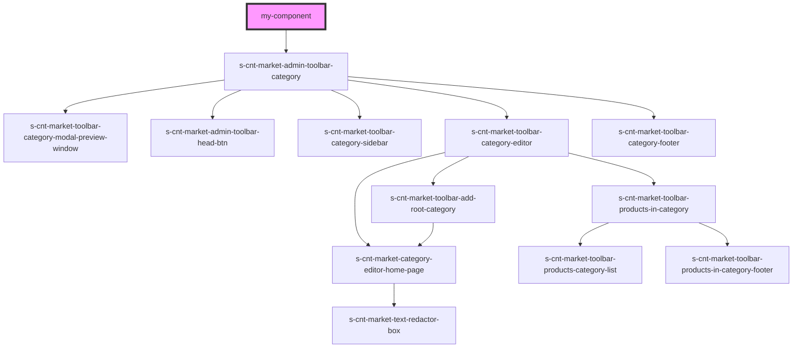

# my-component

<!-- Auto Generated Below -->

## Dependencies

### Depends on

- [s-cnt-market-admin-toolbar-category](../shared/s-cnt-market-admin-toolbar-category)

### Graph

----------------------------------------------

*Built with [StencilJS](https://stenciljs.com/)*
