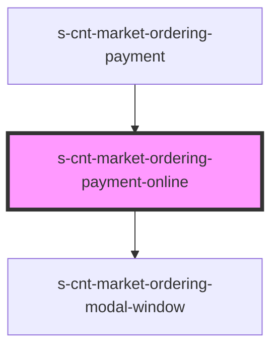

# s-cnt-market-ordering-payment-online

<!-- Auto Generated Below -->

## Properties

| Property         | Attribute         | Description                      | Type                             | Default     |
| ---------------- | ----------------- | -------------------------------- | -------------------------------- | ----------- |
| `errorState`     | `error-state`     | Добавляет класс invalid          | `boolean`                        | `undefined` |
| `orderingModals` | `ordering-modals` | Данные для модалки               | `any`                            | `undefined` |
| `payment`        | --                | Данные для раздела онлайн оплата | `MarketOrderingPaymentInterface` | `undefined` |

## Events

| Event                | Description               | Type               |
| -------------------- | ------------------------- | ------------------ |
| `addClassInvalid`    | Добавление класса инвалид | `CustomEvent<any>` |
| `removeClassActive`  | Удаление класса active    | `CustomEvent<any>` |
| `removeClassInvalid` | Удаление класса инвалид   | `CustomEvent<any>` |

## Dependencies

### Used by

 - [s-cnt-market-ordering-payment](../../..)

### Depends on

- [s-cnt-market-ordering-modal-window](../../../../../../../../../../../../shared/s-cnt-market-ordering-modal-window)

### Graph

----------------------------------------------

*Built with [StencilJS](https://stenciljs.com/)*
