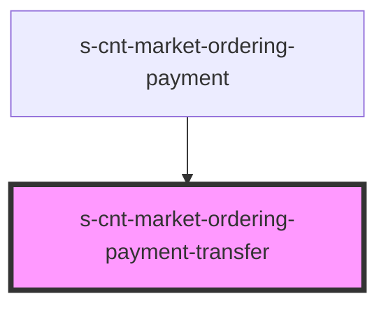

# s-cnt-market-ordering-payment-transfer

<!-- Auto Generated Below -->

## Properties

| Property     | Attribute     | Description                       | Type                             | Default     |
| ------------ | ------------- | --------------------------------- | -------------------------------- | ----------- |
| `errorState` | `error-state` | Добавляет класс invalid           | `boolean`                        | `undefined` |
| `payment`    | --            | данные для блока оплата переводом | `MarketOrderingPaymentInterface` | `undefined` |

## Events

| Event                | Description               | Type               |
| -------------------- | ------------------------- | ------------------ |
| `addClassInvalid`    | Добавление класса инвалид | `CustomEvent<any>` |
| `removeClassActive`  | Удаление класса active    | `CustomEvent<any>` |
| `removeClassInvalid` | Удаление класса инвалид   | `CustomEvent<any>` |

## Dependencies

### Used by

 - [s-cnt-market-ordering-payment](../../..)

### Graph

----------------------------------------------

*Built with [StencilJS](https://stenciljs.com/)*
