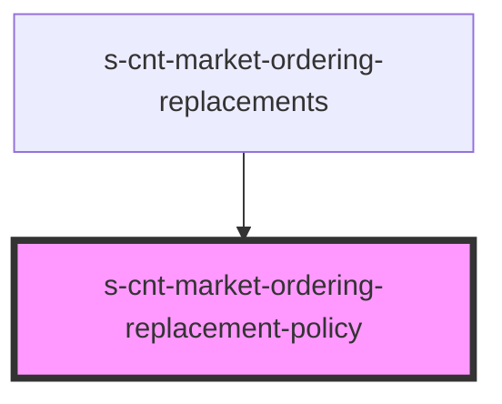

# s-cnt-market-ordering-replacement-policy

<!-- Auto Generated Below -->

## Properties

| Property           | Attribute            | Description                            | Type                            | Default     |
| ------------------ | -------------------- | -------------------------------------- | ------------------------------- | ----------- |
| `lastClickedPanel` | `last-clicked-panel` | Последняя кликнутая панель со временем | `any`                           | `undefined` |
| `panels`           | --                   | Данные для панелей политика доставки   | `MarketOrderingPanelsInterface` | `undefined` |

## Events

| Event          | Description    | Type               |
| -------------- | -------------- | ------------------ |
| `clickOnPanel` | Клик по панели | `CustomEvent<any>` |

## Dependencies

### Used by

 - [s-cnt-market-ordering-replacements](../../..)

### Graph

----------------------------------------------

*Built with [StencilJS](https://stenciljs.com/)*
