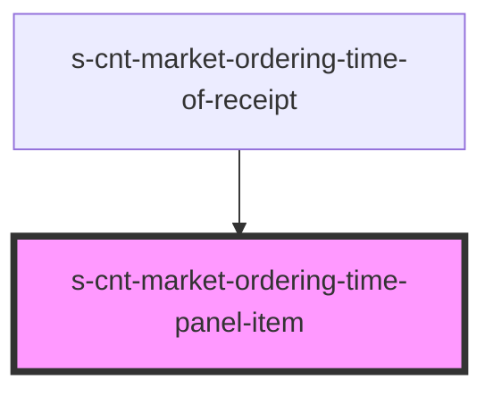

# s-cnt-market-ordering-time-panel-item

<!-- Auto Generated Below -->

## Properties

| Property          | Attribute           | Description               | Type                                   | Default     |
| ----------------- | ------------------- | ------------------------- | -------------------------------------- | ----------- |
| `lastClickedItem` | `last-clicked-item` | Последний кликнутый айтем | `any`                                  | `undefined` |
| `time`            | --                  | Время заказа              | `MarketOrderingTimetableTimeInterface` | `undefined` |

## Events

| Event         | Description             | Type               |
| ------------- | ----------------------- | ------------------ |
| `clickOnItem` | События клика по айтему | `CustomEvent<any>` |

## Dependencies

### Used by

 - [s-cnt-market-ordering-time-of-receipt](../../..)

### Graph

----------------------------------------------

*Built with [StencilJS](https://stenciljs.com/)*
