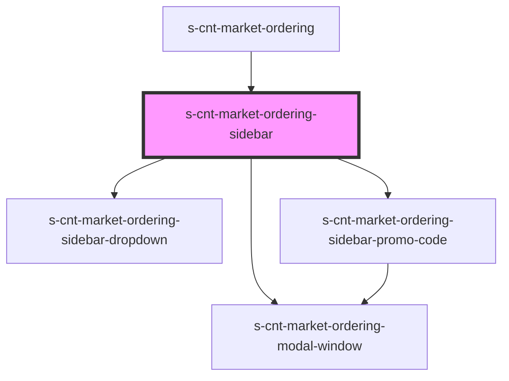

# s-cnt-market-ordering-sidebar

<!-- Auto Generated Below -->

## Properties

| Property          | Attribute          | Description         | Type  | Default     |
| ----------------- | ------------------ | ------------------- | ----- | ----------- |
| `orderingModals`  | `ordering-modals`  | Данные для модалки  | `any` | `undefined` |
| `orderingSidebar` | `ordering-sidebar` | Данные для сайдбара | `any` | `undefined` |

## Events

| Event             | Description             | Type               |
| ----------------- | ----------------------- | ------------------ |
| `clickOnCloseBtn` | Клик по кнопке закрытия | `CustomEvent<any>` |

## Dependencies

### Used by

 - [s-cnt-market-ordering](../../..)

### Depends on

- [s-cnt-market-ordering-modal-window](../../../../../../shared/s-cnt-market-ordering-modal-window)
- [s-cnt-market-ordering-sidebar-dropdown](./res/view/s-cnt-market-ordering-sidebar-dropdown)
- [s-cnt-market-ordering-sidebar-promo-code](./res/view/s-cnt-market-ordering-sidebar-promo-code)

### Graph

----------------------------------------------

*Built with [StencilJS](https://stenciljs.com/)*
