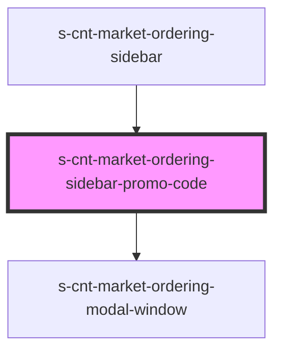

# s-cnt-market-ordering-sidebar-promo-code

<!-- Auto Generated Below -->

## Properties

| Property        | Attribute        | Description          | Type                                       | Default     |
| --------------- | ---------------- | -------------------- | ------------------------------------------ | ----------- |
| `orderingModal` | `ordering-modal` | Данные для модалки   | `any`                                      | `undefined` |
| `promoCards`    | --               | Данные для промокарт | `MarketOrderingSidebarPromoCardsInterface` | `undefined` |

## Dependencies

### Used by

 - [s-cnt-market-ordering-sidebar](../../..)

### Depends on

- [s-cnt-market-ordering-modal-window](../../../../../../../../../shared/s-cnt-market-ordering-modal-window)

### Graph

----------------------------------------------

*Built with [StencilJS](https://stenciljs.com/)*
