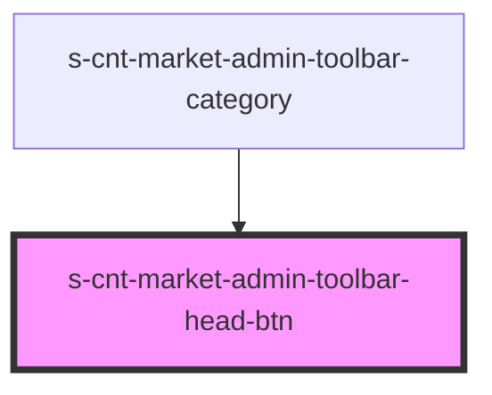

# s-cnt-market-admin-toolbar-head-btn

<!-- Auto Generated Below -->

## Properties

| Property      | Attribute | Description | Type                           | Default     |
| ------------- | --------- | ----------- | ------------------------------ | ----------- |
| `toolbarHead` | --        |             | `AdminToolbarHeadBtnInterface` | `undefined` |

## Events

| Event         | Description | Type               |
| ------------- | ----------- | ------------------ |
| `selectedTab` |             | `CustomEvent<any>` |

## Dependencies

### Used by

 - [s-cnt-market-admin-toolbar-category](../../..)

### Graph

----------------------------------------------

*Built with [StencilJS](https://stenciljs.com/)*
