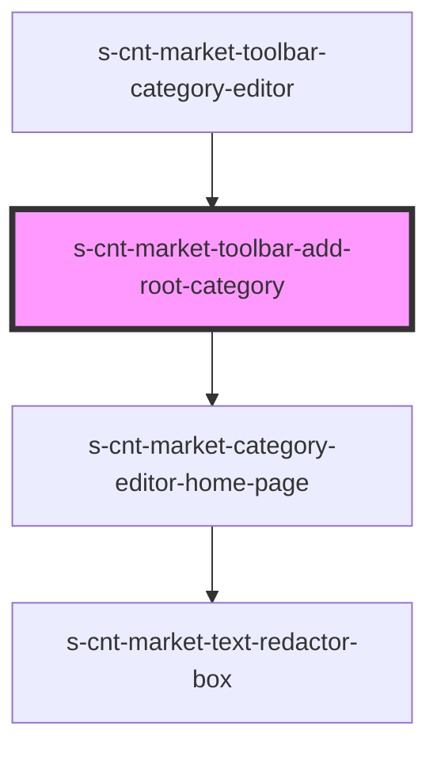

# s-cnt-market-toolbar-add-root-category

<!-- Auto Generated Below -->

## Properties

| Property          | Attribute | Description | Type                              | Default     |
| ----------------- | --------- | ----------- | --------------------------------- | ----------- |
| `addRootCategory` | --        |             | `ToolbarAddRootCategoryInterface` | `undefined` |

## Dependencies

### Used by

 - [s-cnt-market-toolbar-category-editor](../../..)

### Depends on

- [s-cnt-market-category-editor-home-page](../s-cnt-market-category-editor-home-page)

### Graph

----------------------------------------------

*Built with [StencilJS](https://stenciljs.com/)*
