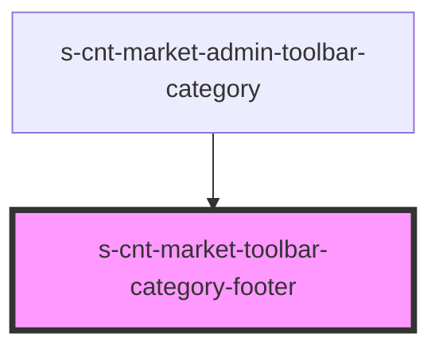

# s-cnt-market-toolbar-category-footer

<!-- Auto Generated Below -->

## Properties

| Property        | Attribute | Description | Type                             | Default     |
| --------------- | --------- | ----------- | -------------------------------- | ----------- |
| `toolbarFooter` | --        |             | `ToolbarCategoryFooterInterface` | `undefined` |

## Dependencies

### Used by

 - [s-cnt-market-admin-toolbar-category](../../..)

### Graph

----------------------------------------------

*Built with [StencilJS](https://stenciljs.com/)*
