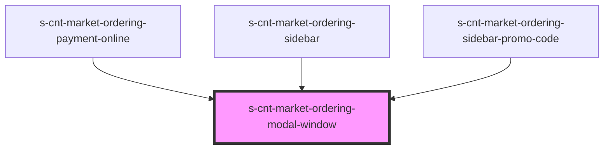

# s-cnt-market-ordering-modal-window

<!-- Auto Generated Below -->

## Properties

| Property        | Attribute        | Description        | Type  | Default     |
| --------------- | ---------------- | ------------------ | ----- | ----------- |
| `orderingModal` | `ordering-modal` | Данные для модалки | `any` | `undefined` |

## Events

| Event             | Description             | Type               |
| ----------------- | ----------------------- | ------------------ |
| `clickOnCloseBtn` | Клик по кнопке закрытия | `CustomEvent<any>` |

## Dependencies

### Used by

 - [s-cnt-market-ordering-payment-online](../../res/view/s-cnt-market-ordering/res/view/s-cnt-market-ordering-column/res/view/s-cnt-market-ordering-payment/res/view/s-cnt-market-ordering-payment-online)
 - [s-cnt-market-ordering-sidebar](../../res/view/s-cnt-market-ordering/res/view/s-cnt-market-ordering-sidebar)
 - [s-cnt-market-ordering-sidebar-promo-code](../../res/view/s-cnt-market-ordering/res/view/s-cnt-market-ordering-sidebar/res/view/s-cnt-market-ordering-sidebar-promo-code)

### Graph

----------------------------------------------

*Built with [StencilJS](https://stenciljs.com/)*
